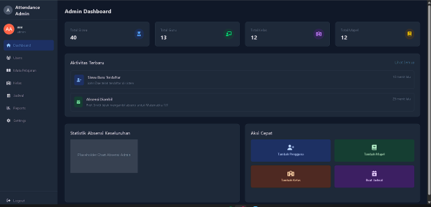
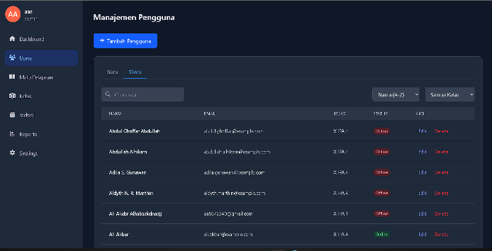
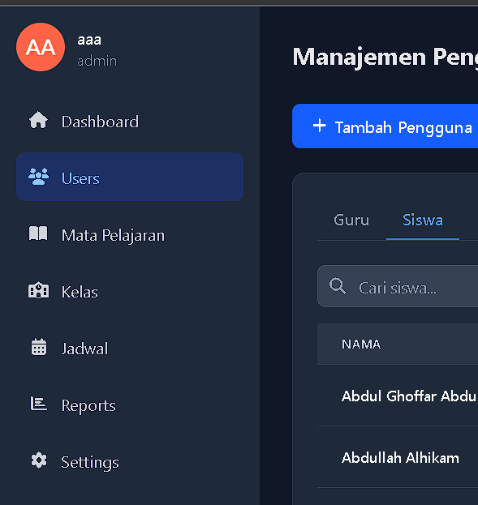
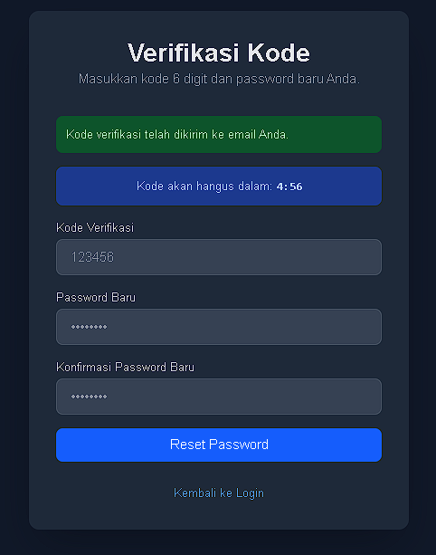
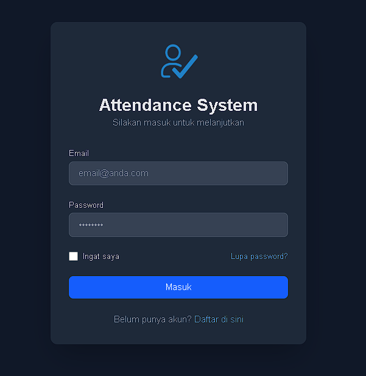
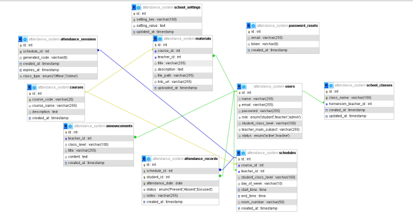
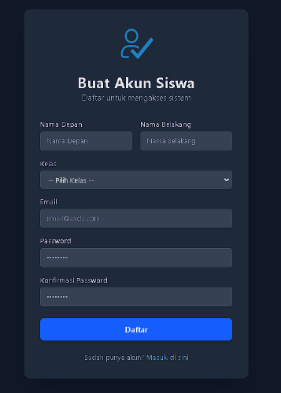
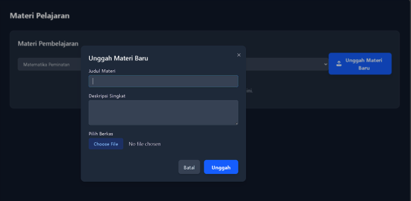

# Presensia: Sistem Manajemen Absensi Berbasis Web

**Presensia** adalah aplikasi manajemen presensi dan kehadiran sekolah berbasis web yang dibangun dengan arsitektur *Client-Server* modern. Sistem ini dirancang untuk menyelesaikan masalah pencatatan kehadiran konvensional dengan menghadirkan otomatisasi absensi, manajemen pengguna terpusat, dan integrasi fitur pendukung pembelajaran.

Proyek ini dikembangkan selama program magang di **PT. Winnicode Garuda Teknologi** (Maret - Juli 2025).

## Arsitektur Teknologi
Sistem ini memisahkan logika antarmuka (*frontend*) dan logika bisnis (*backend*) secara tegas untuk skalabilitas dan kemudahan pemeliharaan:
- **Frontend (Client-Side)**: React.js (Single Page Application / SPA)
- **Backend (Server-Side)**: PHP (RESTful API)
- **Basis Data**: MySQL (Skema: `attendance_system`)

## Fitur Utama Terintegrasi
1. **Hak Akses Berbasis Peran (RBAC - Role Based Access Control)**
   Aplikasi menyediakan 3 *dashboard* khusus yang terisolasi untuk peran yang berbeda:
   - **Administrator**: Memiliki kontrol penuh terhadap Master Data (Pengguna, Kelas, Mata Pelajaran) serta manajemen *Geofencing* untuk absensi.
   - **Guru**: Mengelola absensi harian kelas, mencetak laporan presensi, mengunggah materi pelajaran, dan men- *generate* kode verifikasi presensi yang unik.
   - **Siswa**: Melihat jadwal pelajaran, mengakses materi yang diunggah guru, memantau riwayat kehadiran, serta melakukan konfirmasi absensi mandiri.
2. **Presensi Cerdas (Smart Attendance)**
   Fitur absensi tingkat lanjut yang mengintegrasikan validasi **Geofencing** (konfigurasi zona lokasi absensi oleh Admin) dan sistem **Kode Verifikasi Unik** (di- *generate* oleh Guru).
3. **Fitur Pendukung Pembelajaran**
   Selain absensi, sistem ini memfasilitasi pengunggahan dokumen materi pelajaran oleh Guru per kelas yang dapat diakses langsung oleh Siswa.

## Dokumentasi & Visualisasi Sistem

### Entity Relationship Diagram (ERD)
Perancangan struktur basis data yang mendukung relasi pengguna, jadwal, dan sistem absensi.

### Antarmuka Sistem (User Interface)

**Halaman Login (Otentikasi)**

**Dashboard Administrator**

**Dashboard Guru & Fitur Pendukung**

**Dashboard Siswa**

## Ruang Lingkup Proyek
Aplikasi ini dikembangkan dan difokuskan khusus pada modul manajemen absensi dan penjadwalan terintegrasi. Modul di luar batasan tersebut seperti penilaian ujian akademik dan e-learning interaktif belum diimplementasikan pada iterasi ini.

---
**Pengembang**: Ali Akbar Alhabsyi (Fullstack Developer) - Departemen Teknik Komputer, FTEIC - ITS.